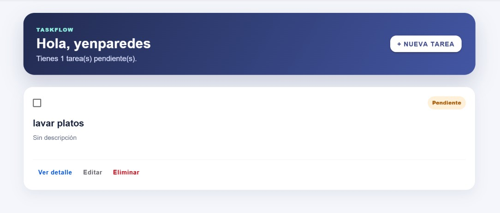

# Challenge 05 — TaskFlow

Aplicación de gestión de tareas desarrollada con **Ionic React**, **TypeScript** y **Firebase**. Permite registrar usuarios, iniciar y cerrar sesión, además de crear, consultar, editar, completar y eliminar tareas almacenadas en Cloud Firestore.

## Objetivo del challenge

Transformar una aplicación de tareas para integrar:

- Autenticación con Firebase.
- Enrutamiento entre las páginas de la aplicación.
- Contextos independientes para autenticación y tareas.
- Hooks personalizados para centralizar la lógica de Firebase.
- Persistencia de las tareas en Cloud Firestore.

## Funcionalidades implementadas

- Registro de usuarios con correo y contraseña.
- Inicio de sesión con Firebase Authentication.
- Cierre de sesión.
- Protección de rutas según el estado de autenticación.
- Visualización de las tareas pertenecientes al usuario autenticado.
- Creación de tareas.
- Consulta del detalle de una tarea.
- Edición de título, descripción y estado.
- Marcación de tareas como completadas o pendientes.
- Eliminación de tareas.
- Almacenamiento de datos en tiempo real con Cloud Firestore.
- Mensajes de carga y manejo de errores con `try/catch`.
- Interfaz responsive diseñada con componentes Ionic y estilos personalizados.

## Cumplimiento de requisitos

| Requisito | Estado |
|---|:---:|
| Login con Firebase | ✅ |
| Registro con Firebase | ✅ |
| Cerrar sesión con Firebase | ✅ |
| Página Login | ✅ |
| Página Register | ✅ |
| Lista de tareas | ✅ |
| Crear tarea | ✅ |
| Editar tarea | ✅ |
| Detalle de tarea | ✅ |
| Rutas entre páginas | ✅ |
| Context para tareas (`TaskContext`) | ✅ |
| Context para autenticación (`AuthContext`) | ✅ |
| Hooks personalizados para Firebase | ✅ |
| Persistencia real en Cloud Firestore | ✅ |

## Tecnologías utilizadas

- Ionic React
- React
- TypeScript (`.tsx`)
- React Router DOM
- Firebase Authentication
- Cloud Firestore
- Vite
- CSS

## Estructura principal

```text
src/
├── contexts/
│   ├── AuthContext.tsx
│   └── TaskContext.tsx
├── hooks/
│   ├── useFirebaseAuth.ts
│   └── useFirebaseTasks.ts
├── pages/
│   ├── Home.tsx
│   ├── Login.tsx
│   ├── Register.tsx
│   ├── TaskDetail.tsx
│   └── TaskForm.tsx
├── theme/
│   └── app.css
├── types/
│   └── Task.ts
├── App.tsx
└── firebase.ts
```

## Rutas de la aplicación

| Ruta | Página | Descripción |
|---|---|---|
| `/login` | Login | Inicio de sesión |
| `/register` | Register | Registro de usuario |
| `/home` | Home | Lista de tareas |
| `/tasks/new` | TaskForm | Creación de una tarea |
| `/tasks/:id` | TaskDetail | Detalle de una tarea |
| `/tasks/:id/edit` | TaskForm | Edición de una tarea |

## Contextos y hooks

### `AuthContext`

Mantiene el usuario autenticado y expone las funciones de registro, inicio y cierre de sesión a todas las páginas.

### `TaskContext`

Comparte la lista de tareas y las operaciones de creación, consulta, actualización y eliminación.

### `useFirebaseAuth`

Encapsula la lógica de Firebase Authentication.

### `useFirebaseTasks`

Encapsula las operaciones de Cloud Firestore y filtra las tareas mediante el identificador del usuario autenticado.

## Modelo de una tarea en Firestore

Cada documento de la colección `tasks` contiene campos como los siguientes:

```ts
{
  title: string,
  description: string,
  completed: boolean,
  userId: string,
  createdAt: Timestamp
}
```

El campo `userId` relaciona cada tarea con su propietario.

## Reglas de seguridad de Firestore

```js
rules_version = '2';

service cloud.firestore {
  match /databases/{database}/documents {
    match /tasks/{taskId} {
      allow create: if request.auth != null
                    && request.resource.data.userId == request.auth.uid;

      allow read, delete: if request.auth != null
                          && resource.data.userId == request.auth.uid;

      allow update: if request.auth != null
                    && resource.data.userId == request.auth.uid
                    && request.resource.data.userId == request.auth.uid;
    }
  }
}
```

Estas reglas permiten que cada usuario autenticado solamente acceda y modifique sus propias tareas.

## Instalación y ejecución

1. Clonar el repositorio y entrar en el proyecto:

```bash
git clone <URL_DEL_REPOSITORIO>
cd natalia-paredes-react-challenges/task-manager
```

2. Instalar las dependencias:

```bash
npm install
```

3. Configurar Firebase en `src/firebase.ts`.

4. Ejecutar la aplicación:

```bash
ionic serve
```

## Evidencias de funcionamiento

### Tarea visible en TaskFlow

La aplicación muestra la tarea **“lavar platos”** en la lista del usuario autenticado, junto con las opciones para ver el detalle, editarla o eliminarla.



### Tarea almacenada en Cloud Firestore

La colección `tasks` contiene el documento correspondiente, incluyendo el título, la descripción, el estado y la fecha de creación. Esto verifica que la información se guarda realmente en Firebase.


## Autora

**Natalia Paredes**  
Challenge 05 — Desarrollo de Aplicaciones Móviles
